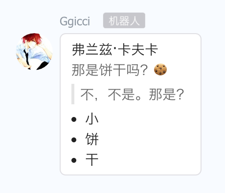

🤖  Dingtalk Robot
=================

**钉钉群机器人**

- [官方文档](https://open-doc.dingtalk.com/docs/doc.htm?treeId=257&articleId=105733&docType=1)

可以用来接入系统告警通知。

## Usage

### 配置机器人

```
rb := robot.New("name", "http://webhook/address/here/...")
```

### 发送文本(Text)

```
m := rb.NewTextMessage()
m.SetText("喂~~~服务器扛不住啦，再不来看看我我就离家出走啦~")
// m.AtMobiles("18600000001", "18600000002")
m.AtAll(true)

if err := m.Send(); err != nil {
  // ...
}
```


### 发送链接(Link)

```
rb.NewLinkMessage().
  SetTitle("谢谢你长那么帅还关注我").
  SetText("人漂亮了就说整容了，那么长得丑就毁过容吗？").
  SetPictureURL("https://ggicci.me/content/images/2016/03/wechat.jpg").
  SetMessageURL("http://ggicci.me").
  Send()
```


### 发送 Markdown

```
down := `
## 弗兰兹·卡夫卡

那是饼干吗？🍪

> 不，不是。那是？

- 小
- 饼
- 干
`
rb.NewMarkdownMessage().
  SetTitle("前前前世").
  SetMarkdown(down).
  Send()
```




